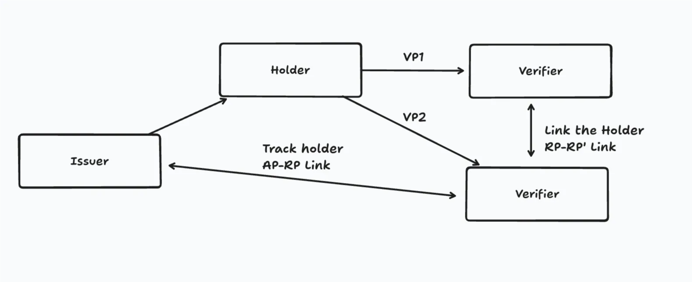
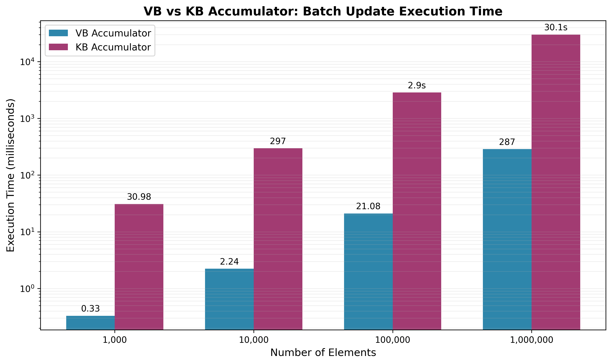

# [WIP] An Analysis of Revocation Schemes for Verifiable Credentials

## Executive Summary

This report provides a detailed technical analysis of prominent revocation schemes for Verifiable Credentials (VCs). We examine each scheme’s specifications, implementations, and privacy properties. The primary objective is to delineate each scheme’s pros and cons, and identify core use cases and recommend the most suitable revocation scheme for each.

---
## 0. Linkablity
One of the major privacy risks of verifiable credentials (VCs) is known as linkability. Linkability refers to the possibility of tracking individuals by collating data from their use of digital credentials. This risk arises when traceable digital signatures or identifiers are reused, allowing different parties to correlate multiple interactions with the same individual, thereby compromising privacy. Such linkability can create surveillance potential across society, whether by private companies, state actors, or even foreign adversaries.

Linkability can occur at different layers. For example, at the credential level, the chosen revocation method can contribute to this risk.

Typically, we can distinguish two main types of linkability:
1. RP–RP linkability: Verifiers share or match data to link different interactions back to the same individual.
2. AP–RP linkability: An issuer and a verifier collude to link different interactions back to the same individual.

To achieve true unlinkability, both the signature scheme and the revocation method must support it. 

## 1. The Need for Revocation in Verifiable Credentials

The lifecycle of a VC does not end at issuance; its validity may need to be nullified before its expiration. This process, known as revocation, is critical for maintaining the integrity and trustworthiness of a digital identity ecosystem.

### 1.1 Stakeholders in the Revocation Process

The revocation process involves several key stakeholders:

* **Issuer:** The entity that issues the credential and, in most cases, manages its revocation status.
* **Holder:** The individual or entity that possesses the credential and presents it for verification.
* **Verifier (Relying Party):** The entity that checks the validity of a presented credential.
* **Revocation Authority:** The entity responsible for maintaining and publishing revocation information. This role may be fulfilled by the Issuer.

### 1.2 Scenarios Requiring Revocation

Revocation becomes necessary in various scenarios, including:

1. **Credential Information Update:** An existing credential with outdated information is revoked and reissued with updated details.

   * **Initiator:** Holder or Issuer.
   * **Scope:** Ecosystem-wide (all verifiers), affects a single credential.

2. **Holder's Private Key Compromise:** If a Holder's private key is lost or stolen, all credentials associated with that key must be revoked to prevent misuse.

   * **Scope:** Ecosystem-wide, affects all credentials verifiable with the Holder's public key.

3. **Issuer's Private Key Compromise:** If an Issuer's private key is compromised, all credentials signed with that key must be invalidated to protect all stakeholders.

   * **Scope:** Ecosystem-wide, affects all credentials verifiable with the Issuer's public key.

4. **Revocation Authority's Private Key Compromise:** Similar to an issuer compromise, this necessitates revoking the entire revocation system's validity.

5. **Blocking Malicious Users[^not-strict]:** A specific Verifier may choose to no longer accept a credential from a user who has violated its policies.

   * **Initiator:** Verifier.
   * **Scope:** Verifier-local, affects a single credential.

6. **Revocation for the Right to be Forgotten[^not-strict]:** A Holder may voluntarily revoke a credential with respect to a specific Verifier to exercise their privacy rights.

   * **Initiator:** Holder.
   * **Scope:** Verifier-local, affects a single credential.

[^not-strict]: These two items are policy-based blocks rather than classical credential revocation; they don’t remove the credential’s cryptographic validity, only its acceptability by certain parties.

---

## 2. Revocation Methods by a Revocation Authority

Several technical methods exist to manage universal revocation statuses for scenarios 1-4.

### 2.1 Bitstring-based (StatusList2021)

This method maps each credential to a single bit in a fixed-length bitstring. When a credential is revoked, its corresponding bit is flipped (e.g., from 0 to 1). This approach is standardized by the W3C as **StatusList2021**.

### 2.2 Accumulator-based

Cryptographic accumulators provide a way to represent a set of elements with a single, constant-size value. A credential's status can be proven by checking its membership (or non-membership) in the accumulator.

* **RSA-based:** Schemes like the CL-Accumulator are based on the strong RSA assumption.
* **Pairing-based:** More recent schemes, such as the VB20 and KB21 accumulators, leverage elliptic curve pairings for greater efficiency.

### 2.3 Range Proof-based

This technique uses zero-knowledge proofs, such as Bulletproofs, to prove that a credential's non-revoked ID lies outside of a specific range of revoked IDs. It offers a balance between privacy and efficiency.

### 2.4 Merkle Tree-based

This method uses a Merkle Tree to maintain the list of revoked credentials. A proof of revocation (or non-revocation) is provided via a Merkle Path, offering an efficient and verifiable data structure.

[TODO] Create a table of methods and their categories.

---

## 3. Comparative Analysis of Accumulator-based Schemes

This section focuses on a comparison between two prominent pairing-based accumulators, as RSA-based methods are generally considered too slow for many modern applications.

### 3.1 Comparison Criteria

* **Computational Cost:** The complexity of generating and verifying proofs.
* **Data Size:** The size of the witness and the public revocation list.

### 3.2 Detailed Comparison: VB20 vs. KB21 Accumulators

We compare the dynamic universal accumulator from Vitto–Biryukov 2020 (**VB20**) and the pairing-based accumulator from Karantaidou–Baldimtsi 2021 (**KB21**).

**Key Differences:**

1. **Behavior on Additions:**

   * **VB20:** The accumulator value \$V\$ is updated for every element addition.
   * **KB21:** Employs "static updates," where the accumulator value is *not* updated on additions (assuming non-membership proofs are not required).

2. **Witness Update Mechanism:**

   * **VB20:** The server distributes an update polynomial (with public coefficients) derived from the batch of additions/deletions. Each user evaluates this polynomial locally to update their witness.
   * **KB21:** No witness updates are needed for additions. Updates are only required for deletions.

3. **Asymptotic Complexity (for a batch of *m* updates):**

   * **VB20:** Communication: \$O(m)\$, User computation: \$O(m)\$, Server computation: \$O(m^2)\$.
   * **KB21:** Communication: \$O(m)\$, User computation: \$O(m)\$, Server computation: \$O(1)\$.

   Based on [ALLOSAUR](https://eprint.iacr.org/2022/1362)

### 3.3 Benchmark Results

The following results are based on empirical measurements, comparing batch update performance.

The graph illustrates that the VB accumulator's execution time for batch updates scales significantly better than the KB accumulator's as the number of elements grows.

**Performance Metrics:**

| Operation                   | VB Accumulator | KB Accumulator  |
| :-------------------------- | :------------- | :-------------- |
| **Witness Generation Time** | 1.7 ms         | \~170 ms (Est.) |
| **Witness Size**            | 144 bytes      | 288 bytes       |

**Batch Update Execution Time (Add + Delete operations):**

| Number of Elements | VB Accumulator | KB Accumulator |
| :----------------- | :------------- | :------------- |
| **1,000**          | 0.33 ms        | 30.98 ms       |
| **10,000**         | 2.24 ms        | 296.53 ms      |
| **100,000**        | 21.08 ms       | 2,855.11 ms    |
| **1,000,000**      | 286.96 ms      | 30,053.34 ms   |

### 3.4 Overall Assessment

* **VB Accumulator:** Empirical measurements show that the VB accumulator is overwhelmingly faster in practice, making it highly suitable for large-scale systems requiring frequent batch updates.
* **KB Accumulator:** While it boasts a superior theoretical server computation complexity of \$O(1)\$, its performance in practice is substantially slower.

In conclusion, the **VB accumulator demonstrates superior practical performance**. However, the **KB accumulator's** feature of not requiring accumulator updates for additions remains an attractive property that could be beneficial in specific use cases with low revocation rates.
