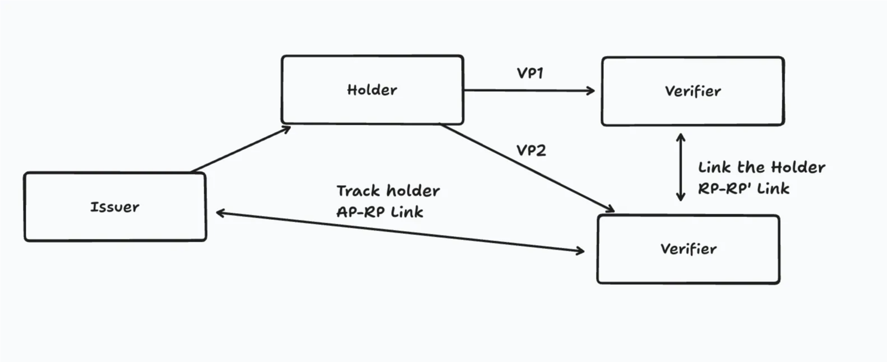
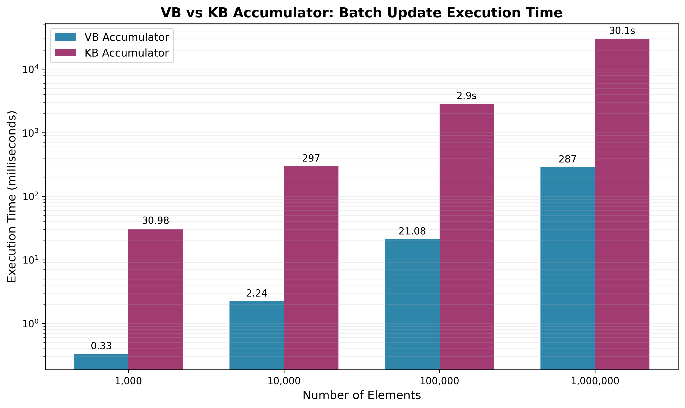
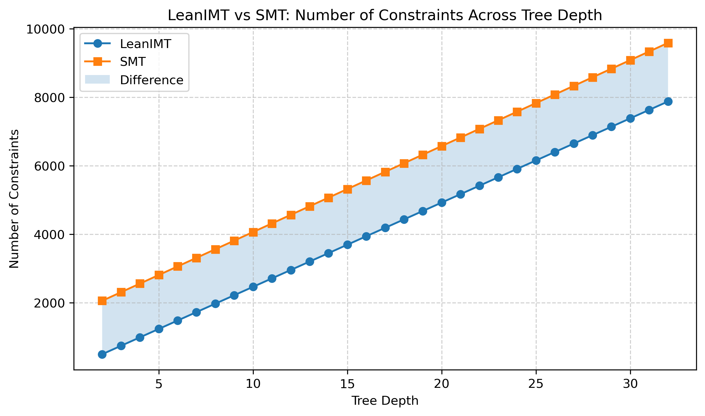
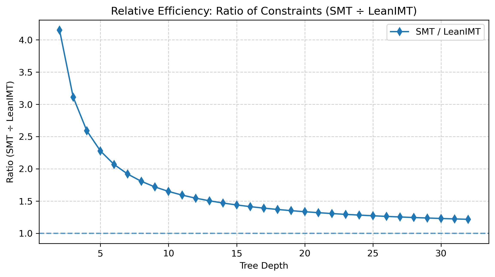

# [WIP] An Analysis of Revocation Schemes for Verifiable Credentials

This report provides a detailed technical analysis of prominent revocation schemes for Verifiable Credentials (VCs). We examine each scheme’s specifications, implementations, and privacy properties. The primary objective is to delineate each scheme’s pros and cons, and identify core use cases and recommend the most suitable revocation scheme for each.

## Reading Guide and Agenda

This report is organized into two complementary analytical layers:  
(1) a **cross-scheme comparison** of revocation approaches, and  
(2) **deep technical analyses** of selected revocation families.

Readers may approach the document linearly or jump directly to sections of interest:

### 1. Privacy and Threat Model
- **[Linkability and Privacy Risks](#linkablity)**  
  Introduces RP–RP and AP–RP linkability, revocation-induced linkability, herd privacy, and privacy requirements.

### 2. Revocation Design Space
- **[The Need for Revocation](#the-need-for-revocation-in-verifiable-credentials)**  
  Describes revocation motivations, stakeholders, and scenarios.
- **[Classification Axes for Revocation Mechanisms](#classification-axes-for-revocation-mechanisms)**  
  Defines the key dimensions used throughout the report to compare revocation schemes.
- **[Overview of Revocation Mechanisms](#overview-of-revocation-mechanisms)**  
  Provides a high-level overview of major revocation approaches, including bitstring-based lists, accumulators, Merkle trees, range proofs, and short-lived credentials.

### 3. Cross-Scheme Performance Comparison
- **[Performance Evaluation of Revocation Schemes](#performance-evaluation-of-revocation-schemes)**  
  Compares different revocation schemes across computational cost, communication overhead, scalability, and deployment scenarios, and provides practical recommendations.

### 4. Deep-Dive Analyses
- **[Comparative Analysis of Accumulator-based Schemes](#comparative-analysis-of-accumulator-based-schemes)**  
  Presents a detailed comparison of pairing-based accumulators (VB20 vs. KB21), including asymptotic complexity and empirical benchmarks.
- **[Comparative Analysis of Merkle Tree-based Schemes](#comparative-analysis-of-merkle-tree-based-schemes)**  
  Analyzes Merkle tree–based revocation schemes (LeanIMT vs. SMT), focusing on performance, constraint efficiency, and use-case-driven trade-offs.

Readers primarily interested in **architectural decisions and scheme selection** may focus on Sections 2 and 3, while readers seeking **implementation-level insight and performance detail** may proceed directly to the deep-dive analyses in Section 4.

---
## Linkablity
One of the major privacy risks of verifiable credentials (VCs) is known as linkability. Linkability refers to the possibility of tracking individuals by collating data from their use of digital credentials. This risk arises when traceable digital signatures or identifiers are reused, allowing different parties to correlate multiple interactions with the same individual, thereby compromising privacy. Such linkability can create surveillance potential across society, whether by private companies, state actors, or even foreign adversaries.

Linkability can occur at different layers. For example, at the credential level, the chosen revocation method can contribute to this risk.

Typically, we can distinguish two main types of linkability:
1. RP–RP linkability: Verifiers share or match data to link different interactions back to the same individual.
2. AP–RP linkability: An issuer and a verifier collude to link different interactions back to the same individual.

To achieve true unlinkability, both the signature scheme and the revocation method must support it. 

### Linkability Introduced by Revocation Mechanisms
Different revocation mechanisms introduce linkability at different layers. Online status checks can reveal verifier behavior to issuers, while static revocation lists may enable correlation when the anonymity set is small. Cryptographic approaches such as accumulators or zero-knowledge Merkle proofs aim to decouple revocation checking from identifier reuse, thereby mitigating RP–RP and AP–RP linkability.

### Herd Privacy and Anonymity Sets

Some revocation mechanisms do not provide cryptographic unlinkability, but instead rely on *herd privacy*. Herd privacy refers to the protection gained by blending an individual’s revocation status check into a large anonymity set of other credentials.

In such schemes, a verifier checks the revocation status of a credential against a shared data structure (e.g., a bitstring or list) that represents many credentials at once. As long as the anonymity set is sufficiently large, it becomes difficult to associate a specific revocation check with a particular individual.

However, herd privacy is inherently probabilistic and degrades under the following conditions:
- Small anonymity sets
- Frequent or irregular updates to revocation data
- Correlation through timing or access patterns

As a result, herd privacy provides weaker guarantees than cryptographic unlinkability and must be carefully evaluated in privacy-sensitive deployments.

Importantly, herd privacy primarily mitigates **AP–RP linkability** by preventing the issuer or revocation authority from observing which credentials are being checked by verifiers. It does not, by itself, prevent **RP–RP linkability**, as verifiers may still correlate credential presentations unless the underlying signature scheme also provides unlinkability.

### Requirements for Complete Privacy Preservation

An ideal revocation mechanism should satisfy the following privacy requirements:

- **Unlinkability**: Multiple credential presentations by the same holder should not be linkable beyond explicitly disclosed attributes.
- **Verifier privacy**: Information about when and where revocation checks occur should not be observable by issuers or revocation authorities.
- **Holder privacy**: The holder’s identity and usage patterns should not be revealed as a byproduct of revocation checking.

## The Need for Revocation in Verifiable Credentials

The lifecycle of a VC does not end at issuance; its validity may need to be nullified before its expiration. This process, known as revocation, is critical for maintaining the integrity and trustworthiness of a digital identity ecosystem.

Beyond linkability, revocation mechanisms can introduce additional privacy risks, including correlation of verification events, inference of usage patterns, and loss of anonymity when credential populations are small.

### Stakeholders in the Revocation Process

The revocation process involves several key stakeholders:

* **Issuer:** The entity that issues the credential and, in most cases, manages its revocation status.
* **Holder:** The individual or entity that possesses the credential and presents it for verification.
* **Verifier (Relying Party):** The entity that checks the validity of a presented credential.
* **Revocation Authority:** The entity responsible for maintaining and publishing revocation information. This role may be fulfilled by the Issuer.

### Scenarios Requiring Revocation

Revocation becomes necessary in various scenarios, including:

1. **Credential Information Update:** An existing credential with outdated information is revoked and reissued with updated details.

   * **Initiator:** Holder or Issuer.
   * **Scope:** Ecosystem-wide (all verifiers), affects a single credential.

2. **Holder's Private Key Compromise:** If a Holder's private key is lost or stolen, all credentials associated with that key must be revoked to prevent misuse.

   * **Scope:** Ecosystem-wide, affects all credentials verifiable with the Holder's public key.

3. **Issuer's Private Key Compromise:** If an Issuer's private key is compromised, all credentials signed with that key must be invalidated to protect all stakeholders.

   * **Scope:** Ecosystem-wide, affects all credentials verifiable with the Issuer's public key.

4. **Revocation Authority's Private Key Compromise:** Similar to an issuer compromise, this necessitates revoking the entire revocation system's validity.

5. **Blocking Malicious Users[^not-strict]:** A specific Verifier may choose to no longer accept a credential from a user who has violated its policies.

   * **Initiator:** Verifier.
   * **Scope:** Verifier-local, affects a single credential.

6. **Revocation for the Right to be Forgotten[^not-strict]:** A Holder may voluntarily revoke a credential with respect to a specific Verifier to exercise their privacy rights.

   * **Initiator:** Holder.
   * **Scope:** Verifier-local, affects a single credential.

[^not-strict]: Scenarios (1)–(4) represent cryptographic revocation, where a credential’s validity is globally invalidated. Scenarios (5) and (6) are policy-based acceptability decisions that do not affect the cryptographic validity of the credential, but rather its acceptance by specific verifiers.

---

## Classification Axes for Revocation Mechanisms

Revocation mechanisms for verifiable credentials can be systematically compared along several orthogonal axes. These axes are used throughout this report to clarify trade-offs and explain design choices.

- **Revocation status distribution model**:  
  Whether revocation information is obtained via online interaction with a revocation authority or through offline, cached data.

- **Cryptographic construction**:  
  Including plain lists, bitstring-based representations, cryptographic accumulators, Merkle tree–based proofs, range proofs, and re-issuance–based approaches.

- **Privacy impact**:  
  Whether the mechanism introduces linkability, relies on herd privacy, or provides cryptographic unlinkability.

- **Temporal characteristics**:  
  Whether revocation takes effect immediately or with bounded delay depending on update frequency.

### Revocation Interaction Models

*This subsection elaborates on the revocation status distribution model, which has particularly strong implications for privacy, availability, and system architecture.*

Revocation methods differ not only in cryptographic construction, but also in how revocation information is obtained during verification. These interaction models have significant privacy and availability implications.

- **Online revocation checking**:  
  The verifier queries a revocation authority in real time to determine credential status. This enables immediate revocation but leaks verification metadata.

- **Offline revocation checking**:  
  The verifier relies on cached or pre-distributed revocation data. This improves privacy and availability, but introduces revocation latency.

- **Holder-provided cryptographic proof**:  
  The holder presents a cryptographic proof of non-revocation (e.g., accumulator witness or Merkle proof) without contacting the issuer or revocation authority.

All revocation mechanisms described in this section can be mapped to one or more of these interaction models.

---

## Overview of Revocation Mechanisms

Several technical methods exist to manage universal revocation statuses for scenarios 1-4.

### Bitstring-based (StatusList2021)

This method maps each credential to a single bit in a fixed-length bitstring. When a credential is revoked, its corresponding bit is flipped (e.g., from 0 to 1). This approach is standardized by the W3C as **StatusList2021**.

Privacy Properties:
StatusList-based revocation provides herd privacy when the anonymity set is sufficiently large (e.g., ≥100,000 credentials). Individual credential status checks are obscured within the group, but privacy degrades significantly for small lists or frequent updates.

### Accumulator-based

Cryptographic accumulators provide a way to represent a set of elements with a single, constant-size value. A credential's status can be proven by checking its membership (or non-membership) in the accumulator.

Accumulator-based revocation schemes provide constant-size proofs of (non-)revocation while preserving unlinkability. They are well suited for privacy-sensitive environments but introduce higher computational and operational complexity.

* **RSA-based:** Schemes like the CL-Accumulator are based on the strong RSA assumption.
* **Pairing-based:** More recent schemes, such as the VB20 and KB21 accumulators, leverage elliptic curve pairings for greater efficiency.

### Range Proof-based

This technique uses zero-knowledge proofs, such as Bulletproofs, to prove that a credential's non-revoked ID lies outside of a specific range of revoked IDs. It offers a balance between privacy and efficiency.

### Merkle Tree-based

This method uses a Merkle Tree to maintain the list of revoked credentials. A proof of revocation (or non-revocation) is provided via a Merkle Path, offering an efficient and verifiable data structure. The Incremental Merkle Tree (IMT) is commonly used for membership proofs. This data structure is used by projects such as [Semaphore](https://semaphore.pse.dev/) and [World](https://world.org/). There is an optimized implementation of an IMT called [LeanIMT](https://zkkit.org/leanimt-paper.pdf). For non-membership proofs, where users prove that their credential is not included in a list of revoked credentials, the [Sparse Merkle Tree (SMT)](https://docs.iden3.io/publications/pdfs/Merkle-Tree.pdf) is commonly used. [Privado.iD](https://www.privado.id/) is an example of a project using this data structure.

### Short-Lived (Ephemeral) Credentials (Non-Authority-Based)

Short-lived credentials avoid explicit revocation mechanisms by issuing credentials with very short validity periods. Once expired, the credential automatically becomes invalid, eliminating the need for a revocation authority to publish revocation status.

While short-lived credentials are not a revocation method managed by a revocation authority, they are commonly considered an alternative approach to revocation and are included here for completeness.

**Characteristics:**
- No revocation list or accumulator
- Offline verification possible
- Strong privacy, as no revocation checks occur

**Limitations:**
- Frequent re-issuance increases issuer load
- Immediate revocation is only possible at issuance boundaries
- Poor fit for long-lived credentials or low-connectivity environments

### Summary Table for Revocation
The table below summarizes the revocation methods discussed in this section.

| Revocation Method | Interaction Model | Proof Type | Privacy Level | Revocation Freshness |
|-------------------|------------------|------------|---------------|----------------------|
| Bitstring (StatusList) | Offline (cached) | Index lookup | Herd privacy (large anonymity set) | Update-period dependent |
| Accumulator (RSA / Pairing) | Holder-provided proof | Membership / Non-membership | Strong unlinkability (RP–RP, AP–RP) | Update-period dependent |
| Range Proof-based | Holder-provided proof | Range non-membership | Strong unlinkability (RP–RP, AP–RP) | Update-period dependent |
| Merkle Tree (IMT / SMT) | Holder-provided proof | Membership / Non-membership | Strong unlinkability (RP–RP, AP–RP) | Update-period dependent |
| Short-Lived Credentials | None (re-issuance) | Expiration check | Strong unlinkability | Validity-period dependent |

---

## Performance Evaluation of Revocation Schemes

This section presents a **cross-scheme overview comparison** rather than an exhaustive evaluation of all variants within each revocation family. The goal is to complement the cryptographic and privacy analyses above with concrete operational trade-offs across issuer, holder, and verifier roles. Detailed variant-level analyses are deferred to the subsequent sections on accumulator-based and Merkle tree–based schemes.

### Evaluation Metrics

We evaluate revocation schemes using the following metrics:

#### Computational Cost
- **Issuer-side:** Cost to update and publish revocation state (e.g., revocation lists, accumulators, trees).
- **Holder-side:** Cost to generate non-revocation evidence (e.g., witness updates, proofs).
- **Verifier-side:** Cost to verify non-revocation evidence.

#### Communication Overhead
- **Revocation data size:** Size of revocation artifacts (lists, accumulator values, proofs).
- **Update frequency:** How often revocation state must be refreshed or re-distributed.
- **Bandwidth requirements:** Sustained bandwidth needed for steady-state operation.

#### Storage Requirements
- **Issuer:** Storage for revocation state and historical versions (if retained).
- **Holder:** Storage for witnesses, proof material, or short-lived credential refresh artifacts.
- **Verifier:** Storage for cached lists / accumulator state / tree roots and related metadata.

#### Scalability
- **Number of credentials:** Maximum manageable credential population.
- **Revocation rate:** Sensitivity to the fraction of revoked credentials.
- **Concurrency:** Throughput under many parallel verifications.

---

### Theoretical Performance Characteristics (by Scheme)

This subsection summarizes asymptotic and systems-level performance characteristics for representative schemes.

#### Bitstring-based (W3C StatusList)

**Computational cost**
- **Issuer:** `O(1)` (flip a bit)
- **Holder:** none
- **Verifier:** `O(1)` (index lookup after decoding/decompression)

**Communication (approximate compressed download sizes)**
- 100,000 credentials: ~12.5 KB
- 1,000,000 credentials: ~125 KB
- 10,000,000 credentials: ~1.25 MB

**Storage**
- **Issuer:** `O(n)` where `n` is total credentials represented by the list
- **Holder:** `O(1)` (stores index and list reference)
- **Verifier:** `O(n)` if caching is used

> Note: The above sizes assume a bit-per-credential representation and are primarily driven by the number of represented credentials.

#### RSA Accumulator (Representative Baseline)

**Computational cost (theoretical)**
- **Issuer:** `O(1)` per update (accumulator update)
- **Holder:** `O(1)` per update (witness update, assuming update material is available)
- **Verifier:** `O(1)` per verification (constant-size proof verification)

**Concrete time examples (2048-bit RSA; indicative)**
- Accumulator update: ~5 ms
- Witness generation: ~10 ms
- Non-membership verification: ~15 ms

**Communication (indicative)**
- Accumulator value: ~256 bytes
- Non-membership proof: ~512 bytes
- Update info: ~300 bytes per update

> Note: This subsection uses RSA accumulators as a representative “constant-size proof” baseline. Pairing-based accumulators (e.g., VB20/KB21) are analyzed in Section 3 with empirical results.

#### zkSNARK-based Non-membership (Sparse Merkle Tree)

**Computational cost**
- **Issuer:** `O(log n)` (tree updates)
- **Holder:** `O(log n)` (proof generation)
- **Verifier:** `O(1)` (verify succinct proof)

**Concrete time examples (Groth16, BN254; indicative)**
- Proof generation: ~100–500 ms (depends on tree depth and circuit)
- Verification: ~5–10 ms
- Trusted setup: minutes to hours (one-time per circuit)

**Communication**
- zk proof size: ~200 bytes (scheme-dependent)
- Merkle path material: `O(log n) × 32 bytes` (if included as public inputs / auxiliary data depending on design)

#### Short-Lived Credentials

**Computational cost**
- **Issuer:** `O(m)` where `m` is refresh frequency (re-issuance workload)
- **Holder:** none (beyond requesting refresh)
- **Verifier:** `O(1)` (signature verification + time validity checks)

**Communication**
Driven by refresh policy:
- Daily refresh: `n × 365` credentials/year
- Weekly refresh: `n × 52` credentials/year
- Monthly refresh: `n × 12` credentials/year

---

### Implementation Benchmarks (Indicative Results)

This subsection lists indicative benchmark results from representative implementations. Results are environment- and implementation-dependent and should be interpreted as directional rather than absolute.

#### Benchmark Environment (Example)

- CPU: Intel Core i7-9700K @ 3.6GHz  
- RAM: 16GB DDR4  
- Implementations: Rust (accumulator), TypeScript (StatusList)  
- Crypto libraries: arkworks (zkSNARK), ring (general crypto)

#### Bitstring Benchmark

| Number of Credentials | Uncompressed Size | Compressed Size | Verification Time |
|----------------------:|------------------:|----------------:|------------------:|
| 1,000                 | 125 bytes         | 40 bytes        | 0.1 ms            |
| 10,000                | 1.25 KB           | 150 bytes       | 0.2 ms            |
| 100,000               | 12.5 KB           | 800 bytes       | 0.5 ms            |
| 1,000,000             | 125 KB            | 8 KB            | 2 ms              |

#### RSA Accumulator Benchmark

| Operation | Avg Time | Std Dev |
|----------|---------:|--------:|
| Accumulator update | 4.8 ms | 0.3 ms |
| Witness generation | 9.2 ms | 0.5 ms |
| Non-membership proof generation | 11.5 ms | 0.7 ms |
| Proof verification | 14.3 ms | 0.8 ms |

#### zkSNARK Benchmark (Merkle depth 20)

| Operation | Avg Time | Memory Usage |
|----------|---------:|-------------:|
| Setup | 45 s | 2 GB |
| Proof generation | 380 ms | 500 MB |
| Proof verification | 6.2 ms | 50 MB |
| Tree update | 2.1 ms | 100 MB |

---

### Scenario-Based Performance Evaluation

This subsection compares schemes under representative deployment scenarios.

#### Large-Scale Deployment (1,000,000 users, 5% revocation rate)

| Scheme | Daily Update Cost | Network Volume / Day | Verification Time |
|--------|-------------------|----------------------|-------------------|
| Bitstring | Minimal | 8 KB | 2 ms |
| RSA Accumulator | Medium | 15 MB | 14 ms |
| zkSNARK | High | 5 MB | 6 ms |
| Short-lived (weekly) | Very high | 100 MB+ | 1 ms |

#### High-Privacy Scenario

| Scheme | Privacy Level | Performance Impact |
|--------|--------------|-------------------|
| Bitstring | Medium (herd privacy) | Minimal |
| RSA Accumulator | High (cryptographic unlinkability) | Medium |
| zkSNARK | High (zero knowledge) | High |
| Short-lived | High (no revocation checks) | High network cost |

#### Real-Time Revocation Scenario

| Scheme | Revocation Propagation | Implementation Complexity |
|--------|-------------------------|---------------------------|
| Online checking | Immediate | Low |
| Bitstring | Update-period dependent | Low |
| Accumulator | Update-period dependent | High |
| Short-lived | Validity-period dependent | Low |

---

### Indicative Cost Analysis (Illustrative)

The following cost estimates are illustrative and depend heavily on deployment architecture, cloud pricing, and operational constraints.

#### Monthly Computation Cost (Example: 1,000,000 users)

| Scheme | Equivalent Compute | Estimated Cost |
|--------|--------------------|---------------:|
| Bitstring | Minimal | $10–50 |
| RSA Accumulator | Medium | $100–500 |
| zkSNARK | High | $500–2000 |
| Short-lived (daily) | Very high | $1000–5000 |

#### Monthly Storage Cost (Illustrative)

| Scheme | Required Capacity | Storage Cost (S3-like) |
|--------|-------------------|------------------------:|
| Bitstring | 1 GB | $0.023 |
| RSA Accumulator | 10 GB | $0.23 |
| zkSNARK | 50 GB | $1.15 |
| Short-lived | 100 GB+ | $2.30+ |

---

### Practical Recommendations

#### Use-Case Driven Recommendations

- **Low cost, large-scale deployment:**  
  **First choice:** Bitstring-based (W3C StatusList)  
  **Rationale:** Standardized, simple implementation, low cost, CDN/cache friendly.

- **High privacy, medium scale:**  
  **First choice:** Accumulator-based revocation  
  **Second choice:** zkSNARK-based revocation (if engineering capacity exists)  
  **Rationale:** Cryptographic unlinkability with practical performance trade-offs.

- **Frequent revocation, small scale:**  
  **First choice:** Short-lived credentials  
  **Rationale:** Operational simplicity and strong privacy when refresh is feasible.

#### Hybrid Approaches

In real deployments, combining techniques can be effective:

1. **Default operation:** bitstring-based revocation for ecosystem-wide interoperability  
2. **High-privacy mode:** accumulator or zk-based proofs for privacy-sensitive flows  
3. **Emergency handling:** optionally combine with online checks for immediate revocation propagation

---

## Comparative Analysis of Accumulator-based Schemes

This section focuses on a comparison between two prominent pairing-based accumulators, as RSA-based methods are generally considered too slow for many modern applications.

### Comparison Criteria

* **Computational Cost:** The complexity of generating and verifying proofs.
* **Data Size:** The size of the witness and the public revocation list.

### Detailed Comparison: VB20 vs. KB21 Accumulators

We compare the dynamic universal accumulator from Vitto–Biryukov 2020 (**VB20**) and the pairing-based accumulator from Karantaidou–Baldimtsi 2021 (**KB21**).

**Key Differences:**

1. **Behavior on Additions:**

   * **VB20:** The accumulator value \$V\$ is updated for every element addition.
   * **KB21:** Employs "static updates," where the accumulator value is *not* updated on additions (assuming non-membership proofs are not required).

2. **Witness Update Mechanism:**

   * **VB20:** The server distributes an update polynomial (with public coefficients) derived from the batch of additions/deletions. Each user evaluates this polynomial locally to update their witness.
   * **KB21:** No witness updates are needed for additions. Updates are only required for deletions.

### Theoretical Evaluation
The Table below summarizes the asymptotic complexity of VB20 and KB21 accumulators for a batch of \(n\) updates, following the analysis in [ALLOSAUR](https://eprint.iacr.org/2022/1362).

| Category | VB20 | KB21 |
|---------------------------|------------------|------------------|
| **Communication Complexity** | O(n) | O(n) |
| **User Computation** | O(n) | O(n) |
| **Server Computation** | O(n²) | O(1) |

Both schemes exhibit linear communication complexity and linear holder-side computation, as witnesses must be updated in response to revocation events. The primary distinction lies in issuer-side computation. VB20 requires quadratic-time computation on the server for batch updates, whereas KB21 achieves constant-time server updates by avoiding accumulator recomputation on additions.

This design choice shifts operational trade-offs. VB20 incurs higher server-side cost but enables efficient witness update distribution using public polynomials, resulting in strong practical performance for large batches. In contrast, KB21 minimizes server computation at the expense of more expensive cryptographic operations during witness generation and verification, which can dominate overall runtime in practice.

Consequently, while KB21 offers superior asymptotic server complexity, VB20 often outperforms it in real-world deployments where batch sizes are large and issuer-side computation is amortized. The choice between the two schemes therefore depends not only on asymptotic complexity, but also on workload characteristics, update frequency, and implementation constraints.

### Benchmark Environment

- CPU: Intel Core i7-9700K @ 3.6GHz  
- RAM: 16GB DDR4  
- Implementations: Rust

### Benchmark Results

The following results are based on empirical measurements, comparing batch update performance.

The graph illustrates that the VB accumulator's execution time for batch updates scales significantly better than the KB accumulator's as the number of elements grows.

**Performance Metrics:**

| Operation                   | VB Accumulator | KB Accumulator  |
| :-------------------------- | :------------- | :-------------- |
| **Witness Generation Time** | 1.7 ms         | \~170 ms (Est.) |
| **Witness Size**            | 144 bytes      | 288 bytes       |

**Batch Update Execution Time (Add + Delete operations):**

| Number of Elements | VB Accumulator | KB Accumulator |
| :----------------- | :------------- | :------------- |
| **1,000**          | 0.33 ms        | 30.98 ms       |
| **10,000**         | 2.24 ms        | 296.53 ms      |
| **100,000**        | 21.08 ms       | 2,855.11 ms    |
| **1,000,000**      | 286.96 ms      | 30,053.34 ms   |

### Overall Assessment

Both VB20 and KB21 accumulators provide cryptographic unlinkability for revocation checks, assuming correct protocol execution. However, their operational differences imply distinct trust and privacy trade-offs.

VB20 requires holders to process accumulator updates for both additions and deletions, which may introduce availability risks if update delivery is unreliable. KB21 reduces holder-side update requirements for additions, potentially simplifying wallet implementations, but still relies on timely deletion updates to maintain correctness.

Importantly, neither scheme leaks revocation usage information to the issuer or revocation authority during verification, as revocation checks are performed using holder-provided cryptographic proofs. As a result, both schemes effectively mitigate AP–RP linkability, with privacy guarantees derived from cryptographic assumptions rather than anonymity-set size.

* **VB Accumulator:** Empirical measurements show that the VB accumulator is overwhelmingly faster in practice, making it highly suitable for large-scale systems requiring frequent batch updates.
* **KB Accumulator:** While it boasts a superior theoretical server computation complexity of \$O(1)\$, its performance in practice is substantially slower.

In conclusion, the **VB accumulator demonstrates superior practical performance**. However, the **KB accumulator's** feature of not requiring accumulator updates for additions remains an attractive property that could be beneficial in specific use cases with low revocation rates.

## Comparative Analysis of Merkle Tree-based Schemes

This section focuses on a comparison between two prominent Merkle tree-based schemes - LeanIMT and SMT. Merkle tree–based revocation schemes diverge based on whether they prove membership (valid credentials) or non-membership (revoked credentials). LeanIMT optimizes membership proofs, while SMT enables efficient non-membership proofs at the cost of higher constraint complexity.
Both approaches are usually implemented with Circom + SnarkJS, using Groth16 as the proving system where these proofs are also compatible with other proving systems such as Plonk, Fflonk, and UltraHonk, which ensures fast client-side generation and low-cost smart contract verification. Since Groth16 is commonly used, these methods require a trusted setup per circuit. 

### Comparison Criteria

* **Computational Performance:** The latency and throughput of tree operations including insert, update, proof generation, and proof verification.
* **Data Size:** The size of cryptographic proofs and storage requirements for the tree structure.
* **Constraint Efficiency:** The number of non-linear constraints required in zero-knowledge circuits, affecting proving time and verification costs.

#### Operations Overview

* **Insert:** Adding a new credential to the merkle tree structure.
* **Update:** Modifying the tree by adding, removing, or changing credential entries.
* **Generate Proof:** Creating merkle proofs off-chain that credential holders can use to demonstrate membership (LeanIMT) or non-membership (SMT) in revocation lists.
* **Verify Proof:** Validating merkle proofs, performed either on-chain by smart contracts or off-chain by other verifying parties.

### Benchmark Environment

**System Specifications:**
- Computer: MacBook Pro
- Chip: Apple M2 Pro
- Memory (RAM): 16 GB
- Operating System: macOS Sequoia version 15.6.1

**Software Environment:**
- Node.js version: 23.10.0
- Circom compiler version: 2.2.2
- Snarkjs version: 0.7.5

Benchmark code is available at: https://github.com/vplasencia/vc-revocation-benchmarks

### Theoretical Evaluation

| Category | LeanIMT | SMT |
| :----------------- | :------------- | :------------- |
| **Time Complexitiy**  | O(log n)[^operation]        | TBW       |
| **Space Complexitiy** | O(n)        | TBW      |

In this table, n is the number of leaves in the Merkle tree.

[^operation] The time complexity of Insert, Update, Generate Merkle Proof and Verify Merkle Proof.

### Benchmark Results: LeanIMT v.s. SMT

#### Performance Comparison Between LeanIMT and SMT

| Operation | LeanIMT Latency (ns) | SMT Latency (ns) | LeanIMT Throughput (ops/s) | SMT Throughput (ops/s) | Performance Advantage |
|-----------|---------------------|------------------|---------------------------|------------------------|----------------------|
| **Insert** | 270,917 ± 1.59% | 2,297,386 ± 11.42% | 3,710 ± 1.27% | 475 ± 3.31% | LeanIMT 8.5x faster |
| **Update** | 547,897 ± 1.72% | 2,075,322 ± 5.41% | 1,836 ± 1.38% | 498 ± 2.57% | LeanIMT 3.8x faster |
| **Generate Proof** | 159.57 ± 33.66% | 52,023 ± 16.39% | 7,583,898 ± 2.84% | 21,040 ± 2.86% | LeanIMT 326x faster |
| **Verify Proof** | 553,753 ± 1.64% | 996,201 ± 5.94% | 1,817 ± 1.52% | 1,041 ± 2.55% | LeanIMT 1.8x faster |

#### Data Size Comparison Between LeanIMT and SMT
| Tree Implementation | Proof Size (bytes) | Proof Size (KB on disk) | Storage Efficiency |
|---------------------|-------------------|------------------------|-------------------|
| **LeanIMT** | 807 | 4 | Optimized |
| **SMT** | 804 | 4 | Standard |

**Note**: Data based on tree depth 10. Both implementations show nearly identical proof sizes with minimal difference.

#### Number of Non-linear Constraints
Constraints are mathematical equations or rules that must be satisfied in cryptographic computations, with non-linear constraints being more complex than simple linear equations. Fewer constraints are preferable because they result in faster proving and verification times, reduced computational overhead, and lower memory requirements. In zero-knowledge proof systems, minimizing constraints leads to smaller proof sizes, cheaper transaction costs, and improved scalability. Additionally, systems with fewer constraints are easier to debug, optimize, and maintain, while also reducing potential security vulnerabilities.

### Overall Assessment

* From the benchmarks, membership proofs (LeanIMT) are faster to compute than non-membership proofs (SMT). 

   * Insert: LeanIMT is 8.5 times faster than SMT
   * Update: LeanIMT is 3.8 times faster than SMT
   * Generate Proof: LeanIMT is 326 times faster than SMT
   * Verify Proof: LeanIMT is 1.8 times faster than SMT

* When revocations are rare, it is often more efficient to use an SMT over revoked credentials. When revocations are frequent, and the number of valid credentials is equal to or smaller than the number of revoked credentials, it can be more efficient to use a LeanIMT over the valid credentials.

* At every tree depth, SMT has between ~1,560 and ~1,710 more constraints than LeanIMT. While the absolute difference grows slowly with depth, the relative ratio decreases: for small depths, SMT can have over 4x more constraints, but by depth 32 it is only about 1.22x more. This shows that LeanIMT provides a large relative improvement for small trees, while still maintaining an absolute advantage for larger trees.

* The optimal choice between LeanIMT and SMT depends on the expected revocation frequency and the relative sizes of valid versus revoked credential sets.
